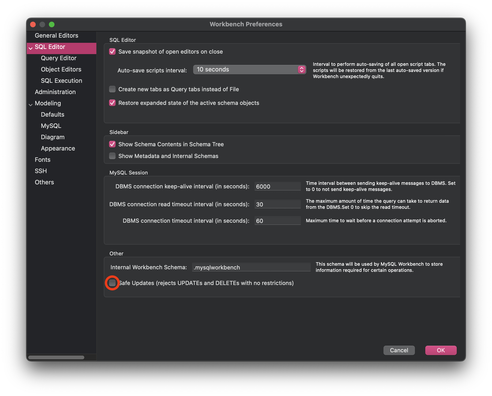

MySQL Workbench has a Safe Mode toggle that can be enabled by default. This can cause issues when trying to run certain queries. Here's how to disable it.

When enabled, the Safe Mode toggle will prevent you from running certain queries that could potentially be harmful to your database. This can be useful in some cases, but it can also be frustrating if you're trying to run a query that you know is safe.

The most common issue we've run into with Safe Mode enabled is when trying to perform an `UPDATE` query that doesn't include a `WHERE` clause containing the `PRIMARY KEY` of the table.

```sql
-- This will cause the Safe Mode Error
UPDATE users SET isArchived = true WHERE isDeleted = true;

-- Error Code: 1175. You are using safe update mode and you tried to update a table without a WHERE that uses a KEY column.  To disable safe mode, toggle the option in Preferences -> SQL Editor and reconnect.

```

Most of the time, you'll want to disable Safe Mode so that you can run any query you like. Here's how to do it:

-   Open MySQL Workbench
-   Open Settings
    -   `macOS`: Go to `MySQLWorkbench` > `Settings`
    -   `Windows`: Go to `Edit` > `Preferences`
-   Select the `SQL Editor` tab
-   Scroll to the bottom and Uncheck the `Safe Updates` option
-   Click `OK` to save your changes
-   Close and Reopen any open connections in MySQL Workbench



Once you've disabled Safe Mode, you should be able to run any query you like without any issues. If you ever need to re-enable Safe Mode, you can follow the same steps and check the `Safe Updates` option again.
