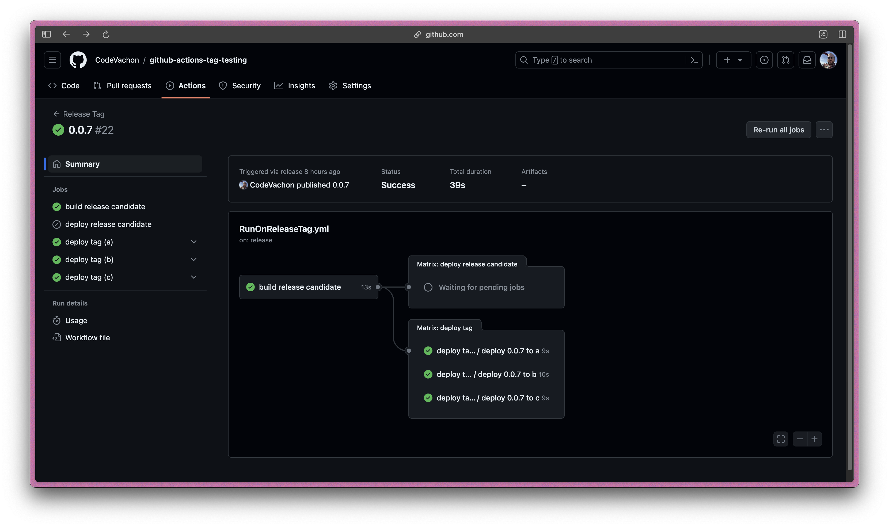

One of the biggest pain points for me working with GitHub Actions is the duplication of workflows within a repository. I've been looking for a way to create reusable workflows that can be shared across multiple workflows and jobs.

The use-case here is having multiple deployment targets that deploy to a different environments dependent on the name of the branch or tag. For example, deploying to a staging environment when a branch is pushed or deploying to production when a tag is pushed. Specifically, I want to be able to change the `job.strategy.matrix` values based on if a tag name contains `RC` effectively allowing for a more gradual deployment process.

This trick here is to use a [workflow_call](https://docs.github.com/en/actions/learn-github-actions/reusing-workflows) event to call a reusable workflow from within another workflow. This allows for the reuse of the same steps across multiple workflows and jobs.

I created a [test repository](https://github.com/CodeVachon/github-actions-tag-testing) to try this out and it worked perfectly. Here is how I set it up.



```yml
# .github/workflows/RunOnReleaseTag.yml
name: Release Tag

on:
    release:
        types: [published]

jobs:
    Build:
        name: build release candidate
        runs-on: ubuntu-latest
        steps:
            - uses: actions/checkout@v4
            - uses: mr-smithers-excellent/docker-build-push@v6
              name: Build & Push App Docker Image
              with:
                  image: app
                  registry: ghcr.io
                  dockerfile: Dockerfile
                  addLatest: ${{ !contains(github.ref_name, 'RC') }}
                  username: ${{ secrets.GHCR_USERNAME }}
                  password: ${{ secrets.GHCR_TOKEN }}

    ReuseableActionForReleaceCandidateTag:
        if: ${{ contains(github.ref_name, 'RC') }}
        name: deploy release candidate
        needs: [Build]
        strategy:
            matrix:
                host:
                    - release-candidate.local.host
        uses: ./.github/workflows/ReuseableAction.yml
        with:
            host: ${{ matrix.host }}

    ReuseableActionForTag:
        if: ${{ !contains(github.ref_name, 'RC') }}
        name: deploy tag
        needs: [Build]
        strategy:
            matrix:
                host:
                    - server1.local.host
                    - server2.local.host
        uses: ./.github/workflows/ReuseableAction.yml
        with:
            host: ${{ matrix.host }}
```

```yml
# .github/workflows/ReuseableAction.yml
name: Reusable workflow

on:
    workflow_call:
        inputs:
            host:
                required: true
                type: string

jobs:
    Run:
        name: deploy ${{ github.ref_name }} to ${{ inputs.host }}
        runs-on: ubuntu-latest
        steps:
            - uses: actions/checkout@v4
            - run: echo "run ${{ github.ref_name }} deployment to ${{ inputs.host }}"
```
